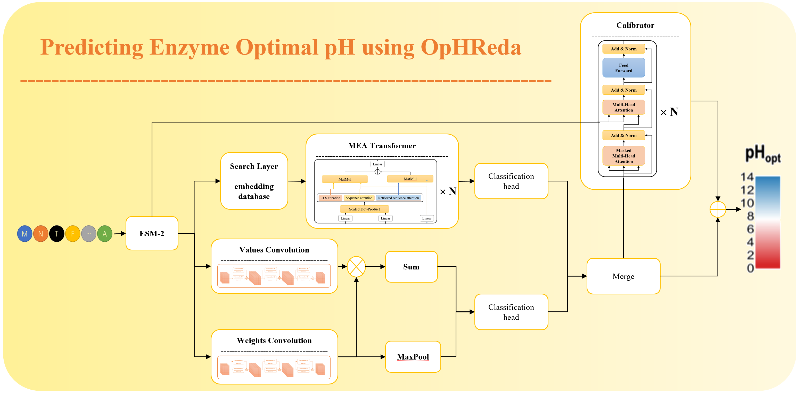

# OpHReda

**Advancing enzyme optimal pH prediction via retrieved embedding data augmentation**



## Overview

OpHReda is a deep learning framework for predicting the optimal pH of enzymes by leveraging retrieved embedding data augmentation. This approach enhances prediction accuracy by integrating relevant information from similar enzymes.

## Getting Started

1. **Download model weights**

   Download the weight files from the link below:

   [Download weight files](https://drive.google.com/file/d/1PusD1o6XLStYTua9SU6KKJXUEzyyRlwz/view?usp=sharing)

2. **Unzip the model weights**

   Unzip the downloaded file and place files to corresponding folders.

   place `model.safetensors` of OpHReda_weight into the `OpHReda` folder.

   place files of `pretrain_models/esm150` into the `pretrain_models/esm150` folder.

   place `database.pt` and `train.csv` into the `pH_dataset/augmentation` folder.

4. **Run the inference**

   ```bash
   python inference.py pH_dataset/case_seq.fasta

4. **Training**
   
   OpHReda employs a multi-stage training process.

   1. Train MEA transformer
   ```bash
   python train_meatransformer.py --config configs/meatransformer.yaml
    ```
   2. Train MRLAT
   ```bash
   python train_mrlat.py --config configs/mrlat.yaml
    ```
   
   3. Train OpHReda
    ```bash
    python train_ophreda.py --config configs/ophreda.yaml
     ```

